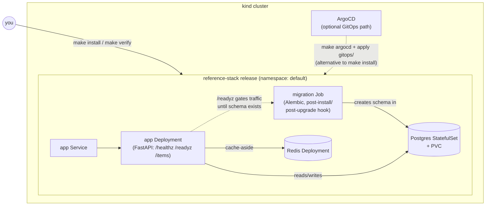

# inferops-reference-stack

A three-tier stack (FastAPI + PostgreSQL + Redis) packaged as a Helm chart
with an idempotent Alembic migration Job, SOPS-encrypted secrets, and an
ArgoCD-driven GitOps deployment path alongside the plain-Helm one. It
demonstrates one specific hard problem — ordering a schema migration
correctly relative to a stateful dependency and an application Deployment,
without turning a PersistentVolumeClaim into a hook resource — and shows
the reasoning behind the solution, not just the solution. Runs entirely on
a local `kind` cluster; no cloud dependency, no real secrets.



## Quickstart

Prerequisites: `docker` (or another kind-compatible runtime), `kind`,
`helm`, `kubectl`, `sops`, `age`.

```bash
make cluster && make install && make verify
```

`make install` decrypts `secrets/secrets.enc.yaml` on the fly — it needs
an age private key at `~/.config/sops/age/keys.txt` (SOPS's default
lookup path). If you don't have the key that `secrets/secrets.enc.yaml`
was encrypted for, generate your own and re-encrypt:

```bash
age-keygen -o ~/.config/sops/age/keys.txt
# copy the "Public key:" line into .sops.yaml's creation_rules.age
make secrets-decrypt   # edit secrets/secrets.dec.yaml with your own value
make secrets-encrypt   # re-encrypts under your key
```

## What to look at, and why

- **`charts/reference-stack/templates/migration/`** — the centerpiece.
  `job.yaml` (plain-Helm, `post-install,post-upgrade` hook) and
  `argocd-job.yaml` (`PostSync` hook) are mutually exclusive, both
  idempotent (Alembic's version table), and both wait for Postgres via a
  polling initContainer, not a fixed sleep. Neither is ordered ahead of
  the app Deployment by hook weight — see `/readyz` below for why.
- **`app/main.py`'s `/healthz` vs `/readyz`** — the actual mechanism that
  keeps the app out of traffic until the migration Job has created the
  schema. `/healthz` never touches Postgres/Redis (liveness must stay
  true regardless of dependency state); `/readyz` checks the schema
  exists and returns 503 until it does.
- **`docs/decisions.md`** — five recorded design decisions, each written
  after something broke on a live cluster during development, not derived
  in the abstract. Read this before touching ordering, probes, or the
  Makefile's `install`/`uninstall` targets — it explains why they're
  shaped the way they are, including two rejected approaches per
  decision and why they didn't work.
- **`secrets/`** — `secrets.enc.yaml` (SOPS + age ciphertext, committed)
  and `age.pub` (public key, committed). No private key material is ever
  in this repository.
- **`gitops/application.yaml`** — the GitOps path. `syncPolicy.automated`
  enables `prune` and `selfHeal`; the comment there explains when
  `selfHeal` is actively the wrong setting (mid-incident manual
  mitigation).

## Design decisions

- Postgres/Redis are hand-written manifests, not Bitnami subcharts —
  Bitnami's 2025 image/chart distribution changes made that dependency
  unsafe to assume as a default without re-verifying it at chart-build
  time, and hand-written manifests avoid the question entirely.
- The migration Job runs as a `post-install`/`post-upgrade` (or
  `PostSync`) hook, not `pre-install` — a `pre-install` hook runs before
  any of the chart's ordinary resources exist, so it can't depend on
  Postgres being up; see `docs/decisions.md` "Migration ordering (round 1)".
- `make install` does not pass `--wait` to Helm — `--wait` blocks on the
  app Deployment's readiness before Helm runs the post-install hook that
  readiness itself depends on, which deadlocks; `make verify` does the
  actual waiting instead, explicitly and in the right order.
- `make uninstall` deletes the release's PVC, which `helm uninstall` does
  not do by default — correct for this disposable dev/demo stack (so
  rotating a secret and reinstalling actually takes effect), and
  explicitly the wrong default for a production release holding real
  data.
- Liveness (`/healthz`) and readiness (`/readyz`) are different endpoints
  rather than one endpoint with different probe timings, so a slow
  migration can never cause Kubernetes to restart an otherwise-healthy
  app pod.
- ArgoCD is pinned to a specific release tag (see the Makefile), not
  `stable`, so `make argocd` produces the same result a year from now as
  it does today.

## Teardown

```bash
make uninstall   # remove the Helm release and its PVC
make destroy     # delete the kind cluster entirely
```
